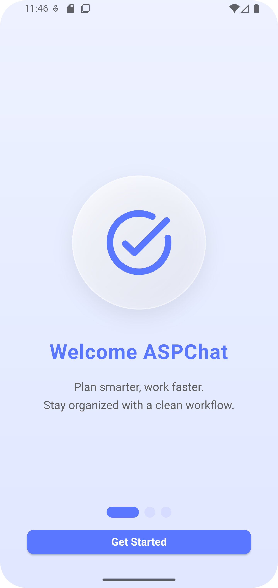
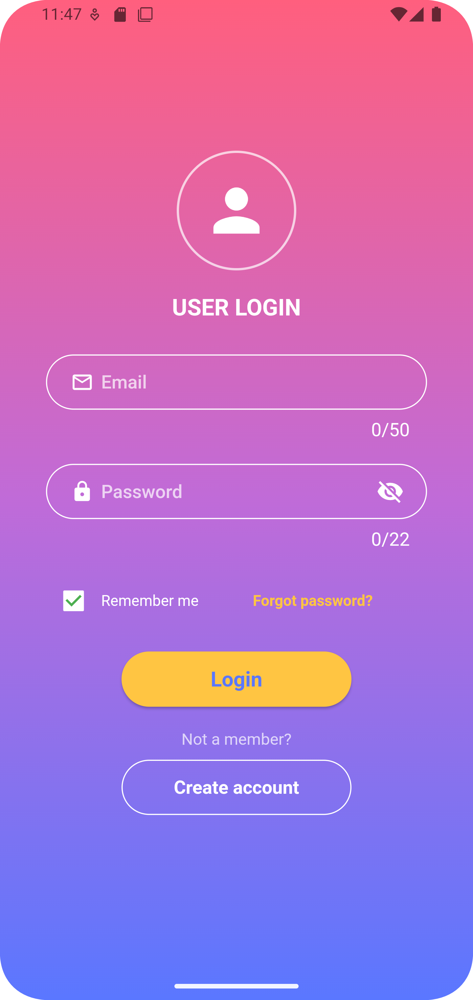
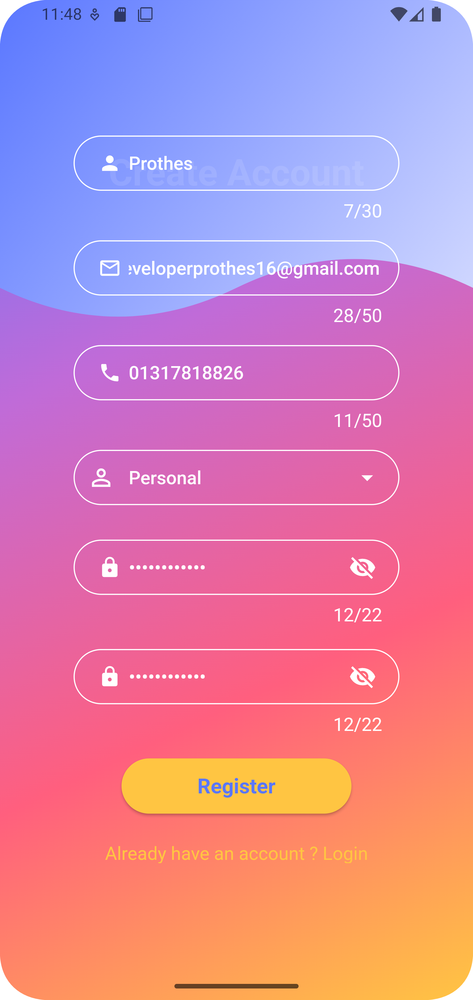

# 💬 ASP Chat Application

🚀 একটি আধুনিক FLUTTER + FIREBASE ভিত্তিক Chat Application, যেখানে real-time messaging এবং clean UI ব্যবহার করে efficient communication করা যায়।

---

## 📸 Screenshots

<p align="center">
  
  
  
</p>

---

## 🧠 Project Overview

এই প্রজেক্টটি একটি chat system, যেখানে users সহজে message পাঠাতে এবং receive করতে পারে।

---

## ⚙️ Features

- 💬 Real-time Chat System
- 🔐 Secure Authentication
- 📡 API Integration Ready
- 📱 Responsive Design
- 🚀 Easy Deployment

---

## 🛠️ Tech Stack

- ASP.NET
- SQL Server
- HTML/CSS
- JavaScript

---

## 🚀 Getting Started

```bash
git clone https://github.com/prothesbarai/asp_chat.git
cd asp_chat
dotnet run
```

---

## 🔧 Configuration

appsettings.json ফাইলে database setup করতে হবে:

```json
"ConnectionStrings": {
  "DefaultConnection": "your_connection_string"
}
```

---

## 👨‍💻 Author

Prothes Barai  
Software Engineer

---
